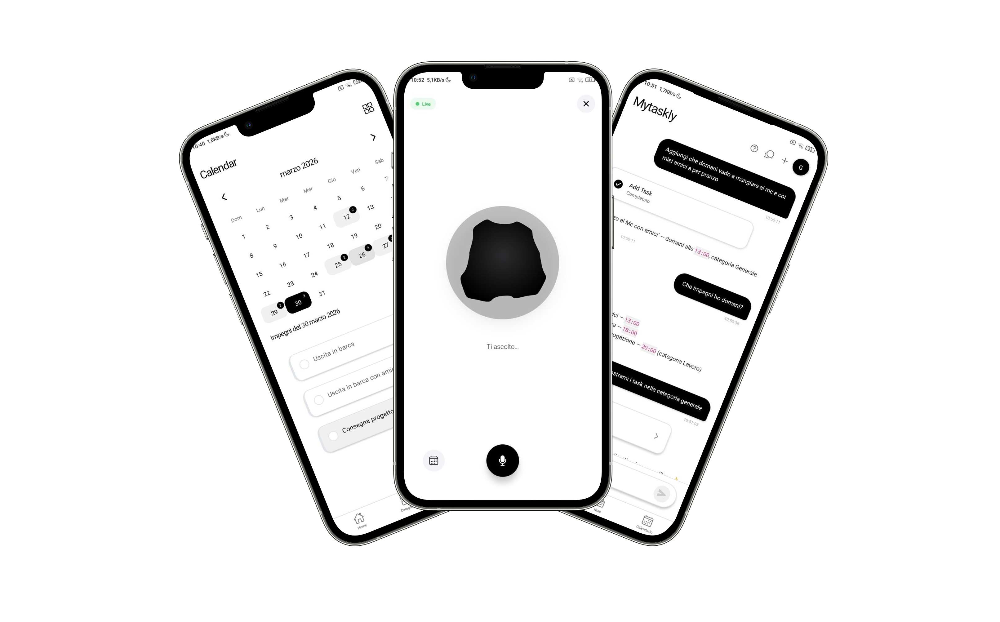
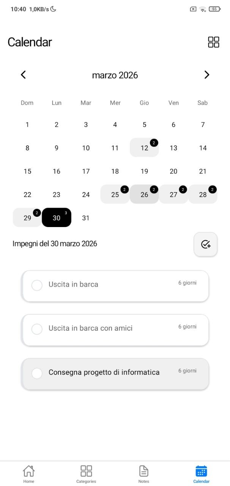
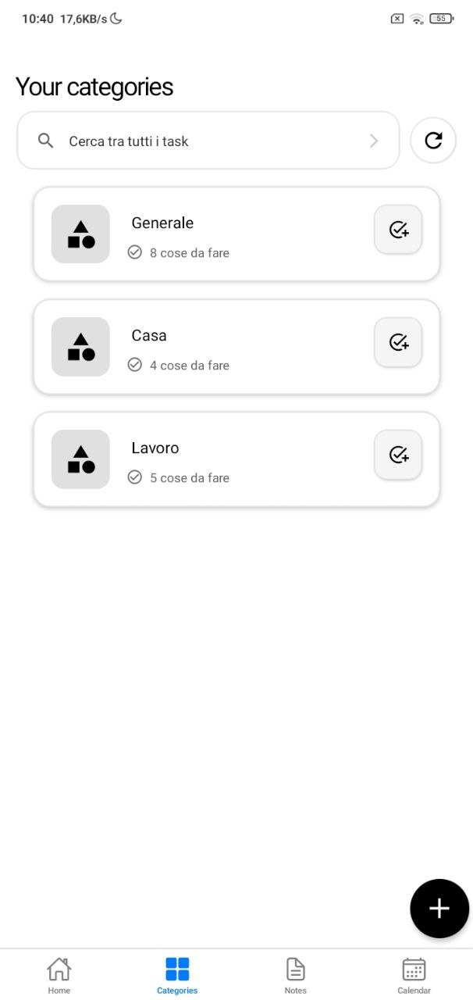

<div align="center">


# MyTaskly

## The Intelligent Task Management App with AI-Powered Voice Assistant

[](https://github.com/Gabry848/MyTaskly-app)
[](./LICENSE.md)
[](https://reactnative.dev/)
[](https://expo.dev/)
[](https://www.typescriptlang.org/)
[](https://github.com/Gabry848/MyTaskly-app)

[Website](https://mytasklyapp.com) • [Download](#-download) • [Features](#features) • [Screenshots](#screenshots) • [Telegram Bot](#-telegram-bot) • [MCP](#-mcp-integration) • [Contributing](#contributing) • [License](LICENSE.md)

</div>

---

> 🤖 **Talk to your tasks.** MyTaskly combines intelligent AI assistance with powerful task management, letting you work smarter, not harder.



---

## 💡 Why MyTaskly?

Most task managers make you adapt to them. MyTaskly adapts to you.

You can type, speak, or just ask — the AI understands what you mean and takes care of the rest. No rigid workflows, no cluttered interfaces. Just your tasks, organized the way you think.

Whether you're a student juggling deadlines, a professional managing projects, or just someone trying to keep life in order, MyTaskly gives you a single place where tasks, notes, calendar, and AI assistance all work together — seamlessly, in real time, even offline.

**Built by Gabriel, a 16-year-old developer** over 11+ months of learning, coding, and iterating. [Read the story →](https://mytasklyapp.com/about)

---

## ✨ Features

| Category | Features |
|----------|----------|
| **🤖 AI Assistant** | Natural language chat • Voice commands with VAD • Smart suggestions • Real-time streaming responses |
| **📝 Task Management** | Rich editor • Custom categories • Shared tasks • Permission controls • Task templates |
| **📅 Calendar** | Built-in calendar view • Google Calendar sync • Smart scheduling |
| **🗒️ Notes** | Colorful sticky-note style notes on a virtual board — pin, organize, and keep ideas at a glance |
| **🔔 Notifications** | Push reminders • Customizable alerts • Cross-device sync |
| **🎨 Design** | Minimalist UI •  Smooth animations • Responsive layout |
| **🔐 Security** | Google Sign-In • MyTaskly account • End-to-end encryption |
| **🎓 Onboarding** | Interactive tutorial • Contextual help • Progress tracking |
| **🌐 Platform** | Android (iOS coming soon)

---

## Screenshots

| AI Assistant | Task Management | Voice Chat |
|:---:|:---:|:---:|
|  |  |  |
| **Smart Conversations** | **Powerful Organization** | **Voice Commands** |

| Calendar View | Category Management | Telegram Bot |
|:---:|:---:|:---:|
|  |  |  |
| **Visual Planning** | **Flexible Sharing** | **Full Control** |

---

## 📥 Download

Get MyTaskly on your device:

<div align="center">

| Platform | Status | Link |
|:---:|:---:|:---:|
| **Android** | ✅ Available | [](https://play.google.com/store/apps/details?id=com.Gabry848Studio.Mytaskly) |
| **iOS** | 🔜 Coming Soon | App Store — coming soon |
| **APK (Direct)** | 🔜 Coming Soon | Direct download — coming soon |

</div>

---

## 💬 Telegram Bot

MyTaskly is also available on **Telegram**! You can manage your tasks, get AI assistance, and stay productive directly from your favorite messaging app.

- **Find the bot**: Search for **[@MyTasklyBot](https://t.me/MyTasklyBot)** on Telegram
- **Login options**: Sign in with your **Google account** or your **MyTaskly account** — no extra setup required
- **Full integration**: The bot is connected to the same backend as the mobile app, so your tasks stay in sync across all platforms

---

## 🔌 MCP Integration

The **MyTaskly MCP** (Model Context Protocol) server is **open source** and lets you connect MyTaskly to any MCP-compatible AI assistant (such as Claude Desktop).

**Repository**: [github.com/Gabry848/MyTaskly-mcp](https://github.com/Gabry848/MyTaskly-mcp)

The MCP server exposes 20 tools across five categories:

- **Task Operations** — retrieve, create, update, and complete tasks
- **Category Management** — organize and manage task categories
- **Notes** — create and manage quick notes
- **Utility Operations** — bulk actions and helpers
- **System Health** — server status monitoring

It uses **OAuth 2.1 with JWT** for secure authentication and is fully stateless — it never accesses the database directly, only communicates with the MyTaskly backend. You can use the official managed service or self-host it with your own instance.

---

## 📖 Usage

### Basic Task Management

1. **Create a Task**: Tap the "+" button on the home screen
2. **Set Details**: Add a title, description, due date, and category
3. **Save**: Your task is automatically synced to the cloud

### Using the AI Assistant

1. **Start a Chat**: Go to the Home tab
2. **Type or Speak**: Ask questions or give commands naturally
   - "Show me today's tasks"
   - "Create a task to buy groceries tomorrow"
   - "What should I focus on this week?"
3. **Voice Mode**: Tap the microphone icon for hands-free interaction

### Sharing Categories

1. **Long press on a Category**: Select the category you want to share
2. **Tap Share**: Use the share button
3. **Invite Users**: Enter email addresses or usernames
4. **Set Permissions**: Choose view-only or edit access

### Calendar Integration

1. **Connect Google Calendar**: Go to Settings → Google Calendar
2. **Authorize**: Sign in with your Google account
3. **Sync**: Your tasks will automatically appear in Google Calendar

---

## 🏗️ Architecture

MyTaskly is built with modern React Native architecture:

```
MyTaskly-app/
├── src/
│   ├── components/         # Reusable UI components
│   │   └── Tutorial/       # Interactive onboarding tutorial system
│   ├── navigation/         # Navigation structure
│   │   └── screens/        # Main app screens (Home, TaskList, BotChat, etc.)
│   ├── services/           # Business logic and API integration
│   ├── contexts/           # React Context providers for global state
│   ├── hooks/              # Custom React hooks
│   ├── utils/              # Helper functions (animations, audio, events)
│   └── constants/          # App configuration and constants
├── assets/                 # Images, fonts, and other static assets
├── app.json                # Expo configuration
├── package.json            # Project dependencies
└── tsconfig.json           # TypeScript configuration
```

### Core Architecture Layers

| Layer | Service | Responsibility |
|-------|---------|----------------|
| **Auth** | `authService.ts` | JWT token management, auto-refresh, Google Sign-In |
| **Data Sync** | `SyncManager.ts` | Offline queue, exponential backoff retry, event-driven sync |
| **Caching** | `TaskCacheService.ts` | In-memory + AsyncStorage dual-layer caching |
| **Tasks** | `taskService.ts` | CRUD with optimistic updates, category filtering |
| **AI Chat** | `botservice.ts` | SSE streaming responses, WebSocket voice interactions |
| **Notifications** | `notificationService.ts` | Expo push notifications, task reminders |
| **Calendar** | `googleCalendarService.ts` | Google Calendar sync and event management |

### Key Patterns

- **Singleton services** — `SyncManager`, `TaskCacheService`, `NetworkService`
- **Optimistic updates** — UI updates immediately, reverts on API failure
- **Event-driven communication** — custom `eventEmitter.ts` for cross-module updates (no prop drilling)
- **Offline-first** — operations queue locally and sync automatically on reconnect
- **Lazy initialization** — services initialize on first use to avoid circular dependencies

### Key Technologies

- **Frontend**: React Native 0.79, TypeScript
- **Navigation**: React Navigation 7 + Expo Router
- **State Management**: React Context API + AsyncStorage
- **UI Components**: Custom components with React Native Reanimated
- **AI Integration**: Custom SSE streaming LLM client
- **Audio**: Expo AV with custom Voice Activity Detection (VAD)
- **Authentication**: Google Sign-In (`@react-native-google-signin`)
- **Notifications**: Expo Notifications
- **Calendar**: Custom Calendar 2.0 component + Google Calendar API
- **HTTP Client**: Axios with interceptors for auth and error handling
- **Data Sync**: Custom SyncManager with offline queue support
- **Build Tool**: Expo EAS Build

---

## Contributing

We love contributions! MyTaskly is an open-source project, and we welcome contributions from developers of all skill levels.

Please read our [CONTRIBUTING.md](./CONTRIBUTING.md) for details on:

- Code of Conduct
- Development workflow
- How to submit pull requests
- Coding standards and best practices

---

## 📝 Changelog

See [CHANGELOG.md](./CHANGELOG.md) for a detailed list of changes and version history.

---

## 📄 License

This project is licensed under the **MIT License** - see the [LICENSE.md](./LICENSE.md) file for details.

---

## 🌟 Support the Project

If you find MyTaskly helpful, consider:

- ⭐ **Starring the repository** on GitHub
- 🐛 **Reporting bugs** and requesting features
- 🔀 **Contributing code** or documentation
- 💬 **Sharing** with friends and colleagues
- ☕ **Supporting the developer** (links coming soon!)

---

## 👨‍💻 About the Developer

MyTaskly was created by **Gabriel** ([@Gabry848](https://github.com/Gabry848)), a 16-year-old developer passionate about creating tools that help people be more productive. This project represents over **11 months** of learning, coding, debugging, and iterating.

> "I built MyTaskly because I wanted to create something that would genuinely help people stay organized while showcasing the possibilities of combining AI with traditional productivity tools." - Gabriel

### Contact & Links

- **Website**: [mytasklyapp.com](https://mytasklyapp.com)
- **GitHub**: [@Gabry848](https://github.com/Gabry848)
- **Project Repository**: [MyTaskly-app](https://github.com/Gabry848/MyTaskly-app)
- **Issues & Bug Reports**: [GitHub Issues](https://github.com/Gabry848/MyTaskly-app/issues)

---

## 🙏 Acknowledgments

Special thanks to:

- The **React Native** and **Expo** teams for amazing frameworks
- The **open-source community** for inspiration and libraries
- **Beta testers** who provided valuable feedback
- Everyone who supported this project during development

---

## 🐛 Known Issues & Roadmap

Check our [GitHub Issues](https://github.com/Gabry848/MyTaskly-app/issues) for:

- Current bugs and issues
- Feature requests
- Planned improvements
- Community discussions

### Coming Soon

- [ ] Desktop app (Electron)
- [ ] Widget support (iOS/Android)
- [ ] advanced AI features
- [ ] Task analytics and insights
- [ ] recurrent tasks

And a lot more!

---

<div align="center">

**Made with ❤️ by a 16-year-old developer**

If you like this project, don't forget to give it a ⭐!

[⬆ Back to Top](#mytaskly)

</div>
